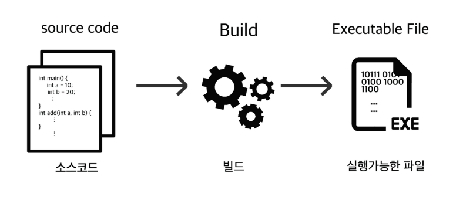
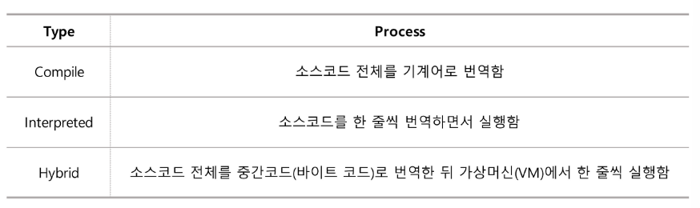
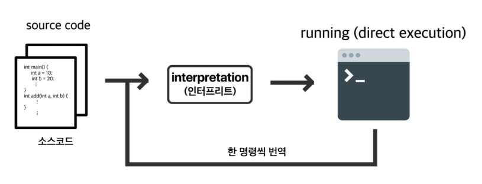

[01. 문법의 기본 구조](../)  
[02. 프로그래밍 작성 구조(OOP, PP)]()  
[03. 코드가 실행파일이 되는 과정(Build)](#03-bulid)

# 03. Bulid

### 0. Build Process
  
> 빌드과정은 크게 3가지 방식으로 분류를 할 수 있다. 

 

### 1. Compile Type(통번역)

1. Preprocessing(전처리)

2. Compilation(컴파일)  
   - 중간언어(보통 어셈블리어)로 번역
   - *.obj 파일이 필요한 이유 : 이진코드를 대응시켜 부호화(Symbolic) 한 low-level-Language는
      
     1. 기능 제공과 보안성 유지
     2. 모듈화 가능
     3. 컴파일 시간 단축
     4. 확장성 이식성 향상 등의 장점이 있다.   
 
3. Assemble(어셈블) : 어셈블리어를 기계어로 번역

4. Link(링크) : 여러 Obj 파일들과 라이브러리들을 연결 시켜주고 실행가능한 파일로 만드는 과정   `컴파일 + 링크 = 빌드`

> 컴파일 언어의 장점
1. 빌드가 완료된 실행가능한 파일은 실행 속도가 빠르다.
2. 매번 번역할 필요 없이 실행 파일로 실행만 할 수 있기 때문에 시간면에서 효율적이다.

> 컴파일 언어의 단점
1. 프로그램을 수정 할 경우 빌드 과정을 처음부터 다시 거쳐야 하기 때문에 대규모 프로그램의 생산성이 떨어진다.
2. 플랫폼에 매우 의존적이다  
`윈도우 실행파일을 mac OS에서 실행하지 못한다.`

### 2. Interpreted Type

> 소스코드의 한 명령 세트마다 기계어로 번역하면서 바로바로 실행해주는 방식

- 인터프리트 언어의 장점
   1. 컴파일과정 없이 바로 실행하기 때문에 수정, 디버깅에 유리, 개발 속도에 유리하다.
   2. 각 OS에 지원하는 인터프리터만 있다면 실행 가능하기 때문에 플랫폼에 독립적

- 인터프리트 언어의 단점  
  1. 빌드 되어있는 컴파일 언어 프로그램보다 실행속도가 느림
  2. 코드를 열면 다 보이기 때문에 보안에 좋지 않음.

