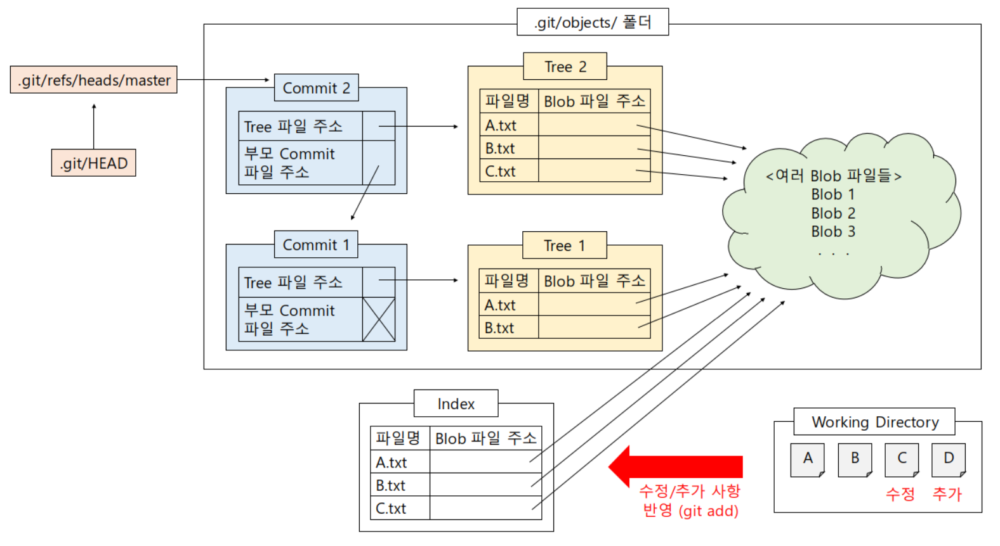

# [Git] 내부 동작 원리에 대한 이해

> 0. 참고 도식



## 1. 용어 정리

### 1-1. Local, Index, Repository

- local(프로젝트 폴더) : 현재 프로젝트 폴더에 존재하는 파일 그 자체

- index(.git/index 파일) : 커밋이 이뤄질 준비가 된 파일의 내용들이 위치하는 영역

  ​	참고로, 인덱스 파일에는 커밋이 이뤄질 준비가 된 파일의 내용들 각각에 대하여 	그 파일명과 해당 파일의 내용을 담고 있는 Blob 파일의 주소(이름)가 기록된다.

- repository (.git/object/ 폴더) : 깃이 버전 관리를 하기 위해 필요로 하는 데이터들을 저장하는 곳. 대표적으로, 버전 관리를 시작한 시점부터 현재 시점까지 관리해온 여러 버전들에 해당하는 파일들의 내용이 Blob 파일로서 이곳에 저장되어 있다. 


### 1-2. 오브젝트 파일

.git/objects/ 폴더에 존재하는 파일

- Blob 파일 : 버전 관리하는 파일들 각각의 내용 Blob  형태의 파일에 저장

  여러 버전에 걸쳐 존재하는 파일들의 내용을 중복 없이 관리할 수 있게 하는 방법: 파일의 내용에 **SHA1**이라는 해싱 기법을 적용하여  Blob 파일의 이름을 얻어내기 때문에, 내용이 같은 파일들은 모두 하나의 Blob 파일로서 저장된다.

  `블랍(Binary large object) : 바이너리 형태로 큰 객체를 저장할 것`

  Working Directory의 파일에 대응하여 내용이 저장되는 Object.

  중요한 것은 Blob에는 파일의 이름이나 형식등은 저장이 되지 않고 파일의 **내용만** 저장된다. 이름이 다른 2개의 파일이라도 하나의  Blob. clone이나 fetch 시에도 파일이 하나만 전동 될 것.

  

- Commit 파일 : 하나의 버전을 생성한다는 것은 하나의 Commit 파일을 만드는 것을 의미한다. Commit 파일은 하나의 Tree 파일을 가리키게 되어 있다.

  가리키고 있는 Tree 파일의 주소와 직전 버전에 해당하는 Commit 파일의 주소가 기록된다.

- Tree 파일 : 커밋 시점의 파일들 각각에 대해 그 파일명과 해당 파일의 내용을 담고 있는 Blob 파일의 주소(이름)가 기록된다. 인덱스 파일과 성격이 유사.


## 2. git 기본 명령어


### 2-1. git init

현재 디렉토리에 .git 폴더를 만들어서 깃이 버전 관리를 할 수 있게 함


### 2-2. git add <파일명>

인덱스의 내용과 비교했을 때 로컬에서 변동된 사항을 인덱스에 반영 시키는 명령어.

<파일명> 대신 . 기호를 사용하면 로컬의 혀내 디렉토리에서 add 명령의 대상이 되는 파일들 전부를 인덱스에 반영한다.


### 2-3. git commit -m '메세지'

인덱스의 내용을 바탕으로 새로운 **버전**(commit 파일)을 생성하는 명령어.

특정 시점에 존재하는 파일들의 정보에 대한 스냅샷을 찍어서 하나의 버전으로서 저장해두겠다는 의미.

<메세지>에는 해당 버전에 대한 설명 등을 기록할 수 있다.

 

### 2.4. git status

- ### a.txt 파일을 만든 직후

```bash
$ git status
# 지금 당장은 설명 넘어가고
On branch master

# Working Directory에 저장된 파일들?
Untracked files:
# git add 사용해봐..
# 포함시키기 위해서 / 커밋이 될 것
  (use "git add <file>..." to include in what will be committed)
        a.txt
# Staging Area가 비어있고, Add 되지 않은 파일이 존재한다.
nothing added to commit but untracked files present (use "git add" to track)
```

- ### b.txt 파일을 만들고 add한 이후

```bash
$ git status
On branch master
Changes to be committed:
  (use "git restore --staged <file>..." to unstage)
        new file:   b.txt

Untracked files:
  (use "git add <file>..." to include in what will be committed)
        a.txt
```


## git log


