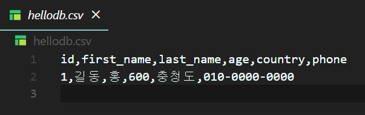
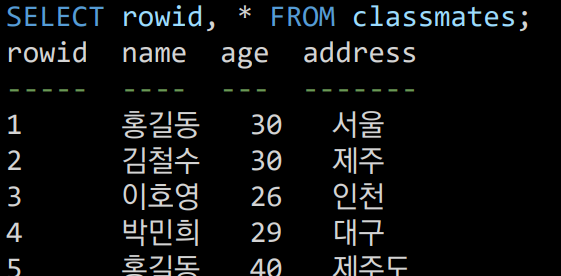

- [1. Database 개념](#1-database)

- [2. Relational Database](#2-rdb-relational-database)
  
- [3. RDBMS](#3-rdbmsrelational-database-management-system)

- [4. Structured Query Language](#4-sql-structured-query-langualge)


- [5. SQLite 설치](#5-sqlite-설치)

- [6. SQL keywords - DML](#6-sql-keywords---data-manipulation-language)

- [7. SQLite3](#7-sqlite3)

- [8. CREATE TABLE 필드 제약 조건](#8-필드-제약-조건)  


- [9. CRUD](#9-crud)  


## 1. Database

1. 목적
   
   - 여러 사람이 공유하고 사용할 목적으로 통합 관리되는 정보의 집합
   
   - 몇 개의 자료 파일을 `조직적으로 통합` -> 자료 항목의 중복을 없애고 구조화

2. 장점
- 중복 최소화

- 무결정 (정확한 정보 보장)

- 일관성, 독립성, 표준화, 보안 유지 등

<br>
<br>


## 2. RDB (Relational Database)

> 서로 관련된 데이터를 저장하고 접근할 수 있는 데이터베이스 유형

#### ⅰ) 스키마 (schema)

- 자료의 구조, 표현방법, 관계 등 전반적인 명세의 기술(구조)

#### ⅱ) 테이블 (table)

- `열: 필드`, `행:레코드`

- 기본키(Primary key) : 각 행(레코드)의 교유값

<br>
<br>

## 3. RDBMS(Relational Database Management System)  


- 관계형 데이터베이스 관리 시스템 : MySQL, SQLite, Oracle DB, SQL Server 등

   ⅰ) SQLite : 비교적 가벼운 DB, 구글 안드로이드 운영체제에 기본적으로 탑재

   ⅱ) Data Type : NUll, INTEGER, REAL, TEXT, BLOB

<br><br>

## 4. SQL (Structured Query Langualge)

- DB를 위해 설계된 특수 목적 프로그래밍 언어

- DB스키마 생성, 수정

- 자료의 검색 및 관리

- DB객체 접근 조정 관리

- 분류
  
  - DDL (Data Definition Language)
  
  - DML (`Manipulation`) : 현재 배울 것, 응용 프로그램과 데이터베이스 사이에 실질적인 데이터 처리를 위해서 주로 사용
  
  - DCL (`Control`)

<br><br>

## 5. SQLite 설치

1) VSCode에서 SQLite 설치
2. [SQLite Download Page](https://www.sqlite.org/download.html) dll파일, tools 파일 다운

3. `C 드라이브`에 - Sqlite 폴더 생성 후 모두 압축 풀어서 파일을 `Sqlite` 폴더로 이동

4. 환경변수 - 시스템 변수 - Path에 `C:WSqlite` 새로 만들기

5. bash 터미널에서 `winpty sqlite3` 입력하여 sqlite> 터미널로 진입 되는지 확인

6. alias 등록
   
   1. bash 터미널에서 code ~/.bashrc
   
   2. `alias sqlite3="winpty sqlite3"`  .bashrc에 해당 내용 추가
   
   3. bash 터미널에서 source ~/.bashrc

7. .gitignore에 *.sqlite3 추가
   
   1. cat 명령어 이용. cat > 는 파일 생성도 가능 as like touch `cat > TIL/.gitignore` 
   
   2. *.sqlite3 추가 후 `ctrl + d`

> cat 명령어 (catenate, concatenate : 연결하다) : 파일을 연결하고 표시하기 위해 사용 `cat > 경로/파일명` 리다이렉션 기호(>)를 사용하여 입력 내용으로 새로운 파일을 만들거나 덮어쓰기 가능 >> 사용시 끝에 이어쓰기 -n 옵션 사용시 행 번호 표기
> 
> cat --help 확인

<br><br>

## 6. SQL Keywords - Data Manipulation Language

#### ⅰ) INSERT : 새로운 데이터 삽입(추가)  C

#### ⅱ)  SELECT : 저장되어있는 데이터 조회 R

#### ⅲ) UPDATE : 저장되어있는 데이터 갱신  U

#### ⅳ) DELETE : 저장되어있는 데이터 삭제  D


```sql
CREATE TABLE classmates(
    id INTEGER PRIMARY KEY,
    name TEXT
);
```

#### ⅵ) DROP TABLE : 데이터베이스에서 테이블 제거

```sql
DROP TABLE classmates;
```

<br><br>

## 7. SQLite3

> 데이터베이스 생성하기

```sql
$ sqlite3 tutorial.sqlite3
sqlite> .database
/* sqlite3는 파일형태로 관리됨 tutorial.sqlite3 파일이 생성되고
이 파일을 건네주면 DB를 건네줄 수 있게 된다.*/
```

> csv(comma seperated variables) 파일을 table로 만들기 



```sql
sqlite> .mode csv
sqlite> .import hellodb.csv <테이블명>
```

> SQLite3 확장 프로그램 사용하기

- .sqlite3 파일 우클릭 후 `Open Database` 클릭 -> SQLite Explorer 라는 항목 EXPLORER에 생성됨.

- SQLITE EXPORER에서 해당 파일명.sqlite3 우클릭 후 New Query 클릭 -> sql 명령어를 작성하는 페이지 생성됨.

- 해당 .sqlite3 파일의 테이블 재생버튼을 누르면 현재 테이블의 상태값을 편하게 볼 수 있음.

> 터미널 view 변경하기

```sql
sqlite> .headers on     /* 스키마 정보 출력 */
sqlite> .mode column    /* 각 스키마 별 간격 맞춰 열로 출력 & --- 표기 추가 */
```

> 테이블들 조회 & 특정 테이블의 스키마 조회

```sql
sqlite> .tables
sqlite> .schema
```

### 8. 필드 제약 조건

> 테이블의 스키마를 만들 때 걸 수 있는 제약 조건

- NOT NULL : NULL 값 입력 금지

- UNIQUE : 중복 값 입력 금지 (NULL 값은 중복 입력 가능)

- PRIMARY KEY : 테이블에서 반드시 하나. NOT NULL + UNIQUE

- FOREIGN KEY : 외래키. 다른 테이블의 Key

- CHECK : 조건으로 설정된 값만 허용

- DEFAULT : 기본 설정 값

```sql
sqlite> CREATE TABLE students(
   ...> id INTEGER PRIMARY KEY,
   ...> name TEXT NOT NULL,
   ...> age INTEGER DEFAULT 1 CHECK (0 < age) 
   ...> );
```

<br><br>

## 9. CRUD

1. INSERT
   
   1. 테이블에 단일 행 삽입 : `INSERT INTO <테이블 이름> (컬럼1, 컬럼2) VALUES (값1, 값2);`
   
   2. 테이블에 정의된 모든 컬럼에 맞춰 순서대로 입력 : `INSERT INTO 테이블이름 VALUES (값1, 값2, 값3);`
   
   3. SQLite에서 PRIMARY KEY가 없는 경우 자동으로 증가하는 PK column : `SELECT rowid, * FROM classmates`
   
   4. PK가 설정된 경우 입력 방법 
      
      ```sql
      CREATE TABLE classmates(
       id INTEGER PRIMARY KEY,
       name TEXT NOT NULL,
       age INT NOT NULL,
       address TEXT NOT NULL
      );
      -- 1)
      sqlite> INSERT INTO classmates VALUES (1, '홍길동', 30, '서울');
      -- 2)
      sqlite> INSERT INTO classmates (name, age, address) VALUES ('홍길동', 30, '서울');
      ```
   
   5. rowid를 사용할 경우 
      
      ```sql
      sqlite> INSERT INTO classmates VALUES 
      ('홍길동', 30, '서울'),
      ('김철수', 30, '제주'),
      ('이호영', 26, '인천'),
      ('박민희', 29, '대구'),
      ('최혜영', 28, '전주');
      ```

2. READ
   
   > SELECT 문은 SQLite에서 가장 기본이 되는 문이며 다양한 절(clause)과 함께 사용
   
   1. LIMIT : 쿼리에서 반환되는 행(레코드) 수를 제한 (OFFSET 키워드와 함께 사용)
      
      ```sql
      /* 세 번째 레코드만 조회 */
      SELECT rowid, name FROM classmates LIMIT 1 OFFSET 2;
      ```
   
   2. WHERE : 쿼리에서 반환된 행에 대한 특정 검색 조건을 지정
      ```sql
      SELECT * FROM classmates WHERE address = '서울';
      ```
   3. SELECT DISTINCT : 조회 결과에서 중복 행을 제거 (SELECT 바로 뒤에 작성해야 함)
      ```sql
      SELECT DISTINCT age FROM classmates;
      ```
   1. OFFSET : 처음부터 주어진 요소나 지점까지의 차이를 나타내는 정수형

3. DELETE : 테이블에서 행을 제거
   1. WHERE
      ```sql
      DELETE FROM 테이블이름 WHERE 조건; 
      /* classmates 테이블에 id가 5인 레코드를 삭제 */
      DELETE FROM classmates WHERE rowid=5;
      ```

   2. AUTOINCREMENT : 삭제된 행의 값을 재사용 하는 것을 방지
      ```sql
      CREATE TABLE students(
         id INTEGER PRIMARY KEY AUTOINCREMENT,
         name TEXT NOT NULL
      );
      ``` 

4. UPDATE : 기존 행(레코드)의 데이터를 수정
   - 기존 clause에서 테이블의 각 열에 대해 새로운 값을 설정
      ``` sql
      UPDATE 테이블 이름 SET 컬럼1=값1, 컬럼2=값2, ... WHERE 조건; 
      -- classmates테이블, id가 5인 레코드의 이름과 주소를 수정
      UPDATE classmates SET name='홍길동', address='제주도' WHERE rowid=5;
      ```


