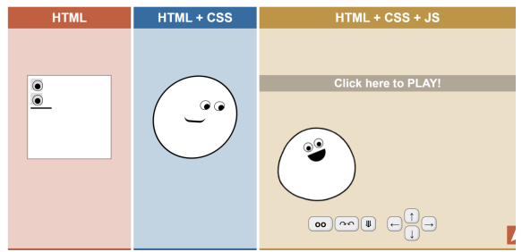
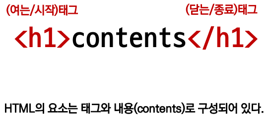
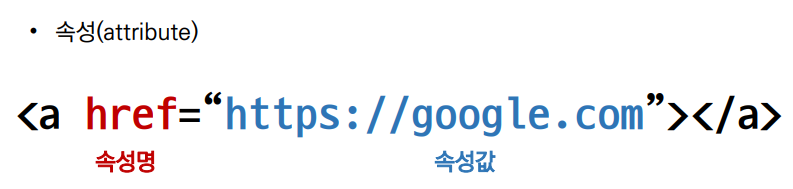
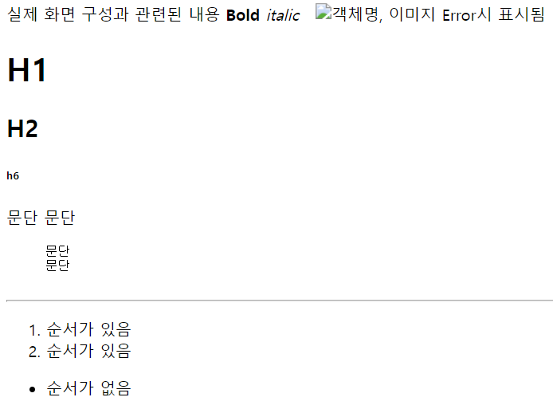

[1. Web concept](#1-html)  

[2. 개발 환경 설정](#2-개발-환경-설정)  

[3. HTML concept](#3-html-기초)  

[4. HTML 기본구조](#4-html-기본구조)

[5. Cascading Style Sheet](#5-csscascading-style-sheet)

<br><br>

# Web

## 1. HTML
  - 웹 사이트의 구성 요소 
    - 구조 : HTML
    - 표현 : CSS
    - 동작 : Javascript  

       
  
  - 개요
    - 웹 사이트는 브라우저를 통해 동작함
    - 브라우저마다 동작이 약간씩 달라서 문제가 생기는 경우가 많았음(파편화)
    - 해결책으로 웹 표준이 등장

  - 웹 표준
    - 웹에서 표준적으로 사용되는 기술이나 규칙
    - 어떤 브라우저든 웹 페이지가 동일하게 보이도록 함(크로스 브라우징)
    - HTML Living Standard : `Mozila`

    - 브라우저별 호환성 체크 : [caniuse.com](https://caniuse.com/)

<br>

## 2. 개발 환경 설정

  - vs code 추천 확장 프로그램 for HTML/CSS
    - Open in browser
    - Auto Rename Tag
    - Auto Close Tag
    - Intellisense for CSS class names in HTML
    - HTML CSS Support
  
  - 크롬 개발자 도구
    - 웹 브라우저 크롬에서 제공하는 개발과 관련된 다양한 기능 제공
    - 주요 기능 :
      - Elements - DOM(문서 객체 모델) 탐색 및 CSS 확인 및 변경
        - Styles - 요소에 적용된 CSS 확인
        - Computed - 스타일이 계산된 최종 결과
        - Event Listeners - 해당 요소에 적용된 이벤트(JS)

    - Sources, Network 등

<br>

## 3. HTML 기초

  - HTML 이란
    - HTML : Hyper Text Markup Language
    
    - Hyper Text란?
      - 참조(하이퍼링크)를 통해 사용자가 한 문서에서 다른 문서로 즉시 접근할 수 있는 텍스트

    - Markup Language란?
      - 태그 등을 이용하여 문서나 데이터의 구조를 명시하는 언어  

    - HTML이란?
      - 웹 페이지를 작성(구조화)하기 위한 언어

<br>

## 4. HTML 기본구조

- html : 문서의 최상위(root) 요소

- head : 문서 메타데이터 요소
  - 문서 제목, 인코딩, 스타일, 외부 파일 로딩 등
  - 일반적으로 브라우저에 나타나지 않는 내용

  - head 예시 :
    ```HTML
    <title> : 브라우저 상단 타이틀
    <meta> : 문서 레벨 메타데이터 요소
    <link> : 외부 리소스 연결 요소 (CSS 파일, favicon 등)
    <script> : 스크립트 요소 (JavaScript 파일/코드)
    <style> : CSS 직접 작성
    ```

    

- body : 문서 본문 요소
  - 실제 화면 구성과 관련된 내용


- 요소(element)  

  
  - HTML 요소는 시작 태그와 종료 태그 그리고 태그 사이에 위치한 내용으로 구성
  - 태그의 쌍을 잘 확인해야 한다. (오류 반환 없음, 레이아웃 깨진 상태로 출력)  

<br>


- 속성(attribute)

      
  - 태그별로 사용할 수 있는 속성은 다르다. 

  - 속성값 할당은 공백 없이 작성한다.

  - 모든 HTML 요소가 공통적으로 사용할 수 있는 대표적 속성
    - id : 문서 전체에서 유일한 고유 식별자 지정
      
    - class : 공백으로 구분된 해당 요소의 클래스 목록 (CSS, JS에서 요소를 선택하거나 접근)

    - style : inline 스타일
    
- [브라우저는 어떻게 동작하는가?](https://d2.naver.com/helloworld/59361)
  > Rendering Process : 웹 사이트 코드를 사용자가 보게 되는 웹 사이트로 바꾸는 과정

- DOM(Document Object Model) 트리 : HTML의 계층 구조
  - 텍스트 파일은 HTML 문서를 브라우저에서 렌더링 하기 위한 구조  

- HTML 요소는 크게 인라인 요소 / 블록 요소로 나눔
  - 인라인 요소는 글자처럼 취급
  - 블록 요소는 한 줄 모두 사용
  - 

- 텍스트 요소
  ```html
  <!-- anchor tag -->
  <a></a> : href 속성을 활용하여 다른 URL로 연결하는 하이퍼링크 생성
  <b></b> : 볼드체
  <i></i> : 이탤릭체
  <!-- 구조적으로 강조를 표현  -->
  <strong></strong>
  <em></em>
  <!-- 텍스트 내에서 줄 바꿈 생성 -->
  <br>
  <!-- src 속성을 활용하여 이미지 표현, 
  alt 속성을 활용하여 대체 텍스트 -->
  
  <!-- 의미없는 인라인 컨테이너 -->
  <span></span>
  ```

- 그룹 컨텐츠
  ```html
    <!-- 문단 : 띄어쓰기만 반영 -->
  <p>
    문단 
    문단
  </p>
  <!-- 미리 정의된 형식(preformatted)의 텍스트 구조화 -->
  <pre>
    문단 
    문단
  </pre>
  <!-- 수평선 -->
  <hr>
  <!-- ordered list, unordered list -->
  <ol>
    <li>순서가 있음</li>
    <li>순서가 있음</li>
  </ol>
  <ul>
    <li>순서가 없음</li>
  </ul>
  ```


  


## 5. CSS(Cascading Style Sheet)

- Cascading : 위에서 아래로 흐르는

- 위에서부터 아래로 흐르며 스타일을 입혀준다.

- 스타일을 지정하기 위한 언어

```css
/* 선택자(Selector) */
h1 {
  /* 선언 */
  color: blue;
   /* 속성 : 값  */
  font-size: 15px; 
}
```

- CSS 정의 방법 
  01. 인라인
      ```html
      <h1 style="color: blue; fonr-size: 100px;">Hello</h1>
      ```
  02. 내부참조
      ```css
      <!-- 유지보수, 재사용에 용이 -->
      h1{
          color: blue;
          font-size: 15px;
        }
      ```

  03. 외부 참조  
      ```
      css파일과 html파일을 별도로 작성
      ```
       


- 주로 활용하는 속성
  ```css
  font-size
  color
  margin-top
  margin-left
  width
  margin-bottom
  margin-right
  padding-left
  padding-top
  height
  padding-bottom
  padding-right
  text-decoration
  font-family
  display
  font-weight
  ```

- CSS 기초 선택자

  - 요소 선택자
    ```css
    h1 {
      color: blue;
      font-size: 20px;
    }
    ```
  - 클래스 선택자
      ```css
      <!-- . 으로 시작 -->
      .blue {
        color: blue;
      }

      <li class="blue"> 글씨 </li>
      ```  
  - 아이디 선택자
      ```css
      <!-- # 문자로 시작 -->
      하나의 문서에 하나만 사용
      # brown 
      {
        color: brown;
      }
      <li id="brown"> 글씨 </li>
      ```
